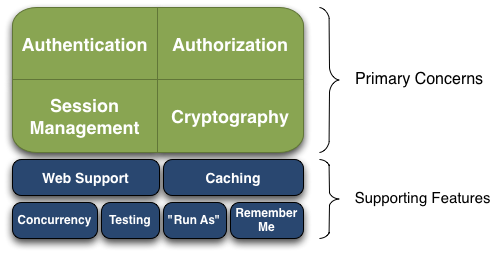

# Apache Shiro安全框架简介

## 什么是Apache Shiro

Apache Shiro是一个强大且灵活的开源安全框架，具备身份认证、授权、会话管理和加密的功能。

Apache Shiro的首要目标是易于使用和理解。安全管理有时可能是非常复杂，甚至是痛苦的，但也可以不是这样子的。框架应尽可能地隐藏复杂性，暴露一个简洁和直观的API，简化开发人员构建应用程序安全管理的工作。

以下是一些使用Apache Shiro后可具备的功能：

* 验证用户以验证其身份。
* 对用户进行访问控制，例如：
  * 确定用户是否被分配到了某个安全角色
  * 确定用户是否被允许做某事
* 在任何环境中使用会话API，即使没有Web或EJB容器。
* 在身份认证、访问控制或会话生命周期内对事件做出响应。
* 聚合1个或多个用户安全数据源，并将这些作为单个复合用户“视图”进行操作。
* 开启单点登录（SSO）功能
* 开启为用户关联的“记住我”服务，无需登录

......

还有更多--所有都集成到一个内聚而易于使用的API里。

Shiro尝试为所有应用程序实现这些目标--从最简单的命令行应用程序到复杂的企业应用程序，而不强制依赖于其他第三方框架、容器、或应用程序服务器。当然，该项目旨在尽可能地集成这些环境中，但它可以在任何环境中开箱即用。

## Apache Shiro特性

Apache Shiro是一个具备众多特性的综合应用程序安全框架。下图显示了Shiro的核心功能，其参考手册也将按类似的组织进行描述：

Shiro集中体现在：Shiro开发团队称之为“应用程序安全的四个基石”这些方面--认证、授权、会话管理和加密。

* **认证（Authentication）：** 有时被称之为“登录”，这用于确定用户是否是合法的用户。
* **授权（Authorization）：** 访问控制的过程，即确定谁可以访问什么。
* **会话管理（Session Management）：** 管理用户特定的会话，即使在非Web或EJB应用程序中。
* **加密（Cryptography）：** 使用加密算法确保数据安全，而且易于使用。

在不同的应用环境中还有其他特性去支持和强化这些问题，特别是：

* Web支持：Shiro的Web支持API有助于更简单地保护Web应用程序。
* 缓存：缓存是Apache Shiro的API中的最底层，用于确保安全操作保持快速和高效。
* 并发：Apache Shiro支持具有并发功能的多线程应用程序。
* 测试：测试支持，可帮助您编写单元测试和集成溑 ，并确保代码按预期得到保护。
* 运行方式（Run As）：这个特性允许用户假扮成另一个用户的身份，有时在管理场景里很有用。
* 记住我（Remember Me）：记住用户在会话中的身份，因此用户一般不需要再进行登录，除非被强制要求进行登录。
