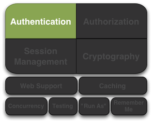

# Apache Shiro认证



认证是身份验证的过程--也就是说，证明一个用户的真实身份。用户为了证明他们的身份，需要提供一些识别信息。

需要通过向Shiro提供用户的主体标识（principals）和凭证（credentials ）来判定是否和系统所期望的匹配。

* **主体标识（Principals）** 是主体的“识别属性”。主体标识可以是标识主体的任何东西，例如用户名（username）、姓氏（surname）、名字（given name）、身份证号等。当然，类似姓氏这样的标识不是很好地唯一识别一个`Subject`--通常使用用户名或电子邮箱。

> :information_source: 最主要的主体标识

> 虽然Shiro可以使用任何数量的主体标识（Principals），但Shiro希望应用程序只有一个“Primary”主体标识--一个唯一标识应用程序中的“Subject”的值。这在大多数应用程序中通常是用户名（username）、电子邮箱（email address）或全球唯一的用户ID。

* **凭证（Credentials）** 通常是只有主体（Subject）知道的秘密值，它们被用作证据，证明他们的真实身份。常见的凭证是密码、生物特征数据（如指纹或视网膜扫描）和X.509证书。

最常见的principal/credential对是username/password。username是声明的身份，password是与声明的身份匹配的证明。如果提交的password和应用程序期望的相匹配，则应用程序可以大胆地假定用户是身份是正确的，因为没有人会知道相同的password了。

## 认证`Subject`

认证`Subject`流程可以被划分为三个步骤：

1. 收集Subject提交的标识和凭证
2. 向authentication逻辑里提交标识和凭证
3. 若处理成功，则允许访问，否则重试认证或禁止访问

下面的代码示范了Shiro的API如何实现这些步骤：

### 第一步：收集Subject的标识和凭证

```java
//Example using most common scenario of username/password pair:
UsernamePasswordToken token = new UsernamePasswordToken(username, password);

//"Remember Me" built-in:
token.setRememberMe(true);
```

### 第二步：提交标识和凭证

### 第三步：处理成功或失败

## Remembered vs. Authenticated

### 有何区别？

### 示例说明

## 退出

## 认证流程

### Authenticator（认证器）

### AuthenticationStrategy（认证策略）

### Realm验证的顺序

#### 隐式顺序

#### 显示顺序

## Realm认证（Realm Authentication）
