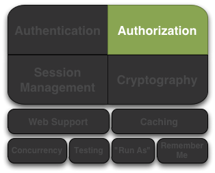

# Apache Shiro授权

授权（也称为 _访问控制_）是管理资源访问的过程。换句话说，控制 _谁_ 有权访问 _什么_。

授权验证的示例：用户是否允许查看此网页、更改数据、操作某按钮或使用打印机？这些都是决定用户有权访问什么资源。

## 授权的元素

授权有三个核心元素：权限（permissions）、角色（roles）和用户（users）。

### 权限（Permissions）

在Shiro中权限表示安全策略里最基本的元素。它本质上是对行为的描述，并明确表示了在应用程序中可以做什么。一个好的权限声明主要描述资源以及当Subject和这些资源交互时可能执行的操作。

以下是一些权限的示例：

* 打开文件
* 查看/user/list页面
* 打印文档
* 删除jsmith用户

#### 权限粒度

### 角色（Roles）

### 用户（Users）

## 对Subjects授权

### 编程式授权

#### 基于角色的授权

##### 角色检查

##### 角色断言

#### 基于权限的授权

##### 权限检查

###### 基于Object的权限检查

###### 基于String的权限检查

##### 权限断言

### 注解方式授权

#### 配置

#### `RequiresAuthentication`注解

#### `RequiresGuest`注解

#### `RequiresPermissions`注解

#### `RequiresRoles`注解

#### `RequiresUser`注解

### JSP标签库授权

## 授权流程

### `ModularRealmAuthorizer`

#### Realm授权顺序

#### 配置全局的`PermissionResolver`

#### 配置全局的`RolePermissionResolver`

### 定制Authorizer
